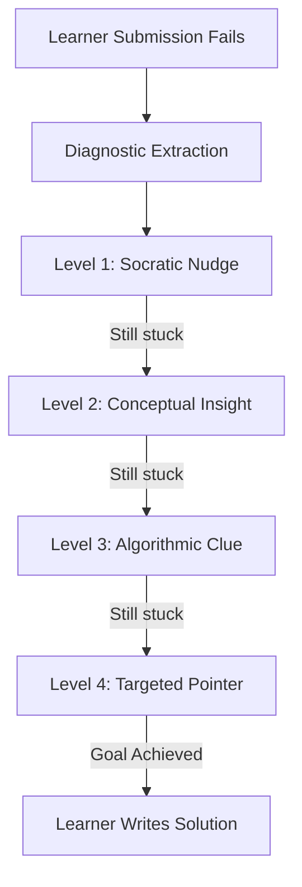

# AI Mentor: Progressive Socratic Engine

## 1. Vision & Socratic Philosophy

The role of the AI Mentor is **not** to solve coding challenges for the learner, but to cultivate analytical problem-solving and algorithmic thinking.

Traditional AI coding assistants (e.g. ChatGPT, GitHub Copilot) act as generative co-pilots that provide the final code immediately. This creates passive learning and deprives learners of the debugging struggle necessary for mastery.

The **AI Coding Mentor** enforces a **Socratic Ladder**: it acts as an experienced tutor looking over the learner's shoulder, asking guiding questions and highlighting misconceptions.

---

## 2. Progressive Socratic Ladder (4 Tiers)



### Level 1: Socratic Nudge
- **Intent**: Gently guide attention to the symptom without identifying the defect.
- **Tone**: Inquisitive, observational.
- **Example**: *"When the input array has only one element, what value does your accumulator variable hold when the loop terminates?"*

### Level 2: Conceptual Insight
- **Intent**: Explain the underlying computer science concept or invariant.
- **Tone**: Educational, theoretical.
- **Example**: *"In Java, division between two integers performs truncation towards zero. If you calculate `5 / 2`, the result is `2`, discarding the fractional remainder."*

### Level 3: Algorithmic Clue
- **Intent**: Suggest the pattern or data structure needed to resolve the complexity or logic bug.
- **Tone**: Architectural, structured.
- **Example**: *"To check for complementary values in $O(N)$ time instead of nested loops, consider a data structure that offers $O(1)$ average lookups, such as a `HashMap`."*

### Level 4: Targeted Pointer
- **Intent**: Pinpoint the exact line or block containing the logical bug.
- **Tone**: Specific, diagnostic.
- **Example**: *"Look closely at line 14 where you update `currentIndex = currentIndex + 2`. Under what conditions could this jump past the termination check?"*
- **Absolute Boundary**: Never write the corrected code. Explain *why* the current line causes the bug.

---

## 3. Ollama Integration Architecture

- **Local Inference**: Runs against a local Ollama server (`http://localhost:11434` or container alias `http://ollama:11434`).
- **Recommended Open Models**:
  - `qwen2.5-coder:7b` (high coding reasoning, small footprint)
  - `deepseek-coder:6.7b` (robust syntax and logic deduction)
  - `llama3:8b` (conversational and pedagogical tone)
- **Zero Paid APIs**: Absolutely no OpenAI, Anthropic, or paid cloud AI APIs are used.

---

## 4. Prompt Engineering & Anti-Spoil System

System prompts are strictly conditioned to:
1. Deny any request by the learner to *"just give me the code"* or *"show me the answer"*.
2. Prevent code generation: system prompts forbid code blocks (```` ```java ````) in responses.
3. Require output in a validated JSON schema:

```json
{
  "hintLevel": 1,
  "socraticStage": "NUDGE",
  "mentorMessage": "String containing markdown explanation without code blocks",
  "conceptIdentified": "Loop boundary off-by-one",
  "guidingQuestion": "What is the highest valid index of an array with length N?"
}
```

---

## 5. Output Validation Pipeline

1. **Schema Check**: All LLM JSON responses are deserialized into a strongly-typed `MentorHintResponse` DTO.
2. **Anti-Leak Regex Filter**:
   - The response is scanned for Java code patterns (e.g. `class `, `public static void`, semicolons at line ends).
   - If code generation is detected, the response is discarded, and a safe, deterministic fallback hint based on the classified mistake is returned instead.
3. **Audit Log**: The generated hint is stored in `hints` table associated with the learner's session.
