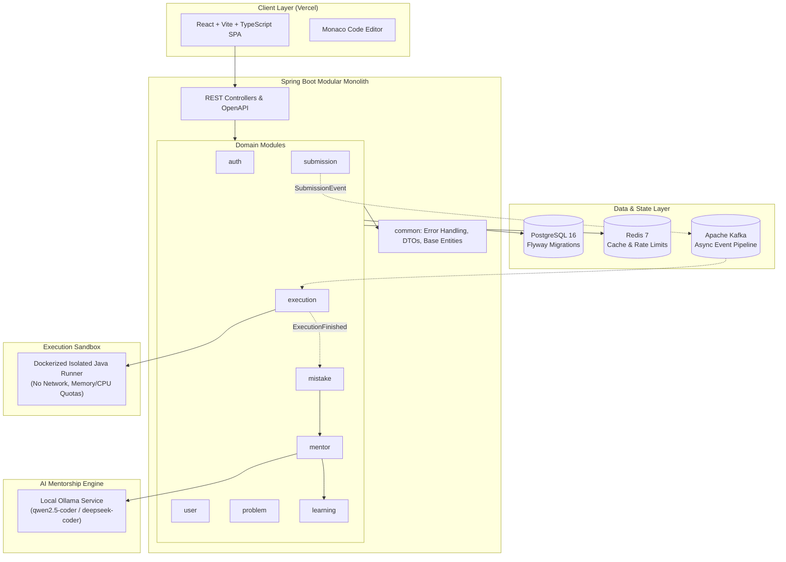

# Architecture Overview

## 1. Architectural Philosophy

**AI Coding Mentor** is designed as a **Modular Monolith** running within a single Spring Boot application runtime for its core domain services, while delegating untrusted code execution to isolated sandbox containers and AI inference to local/self-hosted LLM engines.

### Why Modular Monolith?
- **Domain Cohesion**: Enables rapid evolution of business concepts without the operational overhead, network latency, distributed transactions, and deployment complexity of microservices.
- **Strict Boundaries**: Domain logic is partitioned into clean, decoupled Java packages with explicit public APIs, preventing spaghetti code.
- **Evolutionary Path**: As submission volume or processing load grows, asynchronous boundaries (via Kafka) allow seamless extraction of the execution worker or AI mentorship into dedicated autonomous services without rewriting business rules.

---

## 2. High-Level System Topology

---

## 3. Backend Module Specifications

All domain modules reside under `com.aicodingmentor`:

| Module | Core Responsibility | Key Concepts / Boundaries |
|---|---|---|
| **`common`** | Shared cross-cutting concerns | `ApiResponse<T>`, `ErrorResponse`, `GlobalExceptionHandler`, base auditing entities. No domain logic. |
| **`auth`** | Identity, authentication, token management | JWT issuance, password hashing with BCrypt, security filter chain. |
| **`user`** | User profile and statistics | User accounts, preferences, solved problems counter, mastery metrics. |
| **`problem`** | Problem catalog and test suites | Problem descriptions, starter templates, difficulty, public sample tests, hidden test cases. |
| **`submission`** | Code submissions lifecycle | Receives learner code, persists submission records, assigns status (`PENDING`, `RUNNING`, `EVALUATED`, `ERROR`). |
| **`execution`** | Code execution orchestration | Packages user code with test runners, dispatches to sandboxed runners, collects output and execution metrics. |
| **`mistake`** | Error & failure diagnostics | Classifies failures: Syntax Error, Runtime Exception, Logic Mismatch (assertion failure), Time Limit Exceeded (TLE). |
| **`mentor`** | Progressive Socratic hints | Manages hint state progression, formats prompts for Ollama, validates structured LLM hints, prevents solution leakage. |
| **`learning`** | Educational progression & retention | Tracks learner problem-solving history, hint usage patterns, cognitive concept mastery. |

---

## 4. Communication & Coupling Rules

1. **In-Process Module Interactions**:
   - Modules interact primarily via high-level Spring services or domain event publishers (`ApplicationEventPublisher`).
   - Modules MUST NOT query or join another module's JPA repositories directly.
2. **Asynchronous Processing Pipeline**:
   - Long-running operations (sandboxed compilation, test execution, LLM hint synthesis) are queued via asynchronous workers or Kafka topics to ensure sub-100ms HTTP response times for submission intake.
3. **No Direct Host Execution**:
   - The Spring Boot application NEVER invokes `Runtime.getRuntime().exec("javac ...")` or `ProcessBuilder` on the host machine. All execution is isolated inside dedicated worker containers.

---

## 5. Technology Standards

- **Java 17 / Spring Boot 3.3.x**: Leverages modern Java language features (records, pattern matching, sealed interfaces).
- **PostgreSQL 16**: Relational storage for problems, users, submissions, and structured test metadata.
- **Flyway**: Versioned, reproducible SQL schema migrations.
- **Redis 7**: Fast cache for problem metadata, rate limiting, and session tokens.
- **Ollama**: Open-source, local AI inference runtime communicating over HTTP REST.
