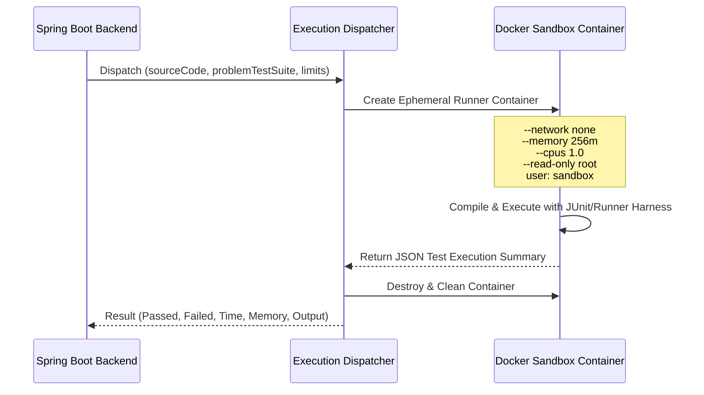

# Isolated Code Execution Sandbox

## 1. Security Threat Model

Executing arbitrary user-submitted code is the highest risk component of any coding platform. The threat landscape includes:
- **Fork bombs and resource exhaustion**: Infinite loops or recursive thread creation hanging the host CPU or consuming all RAM.
- **Filesystem tampering**: Attempting to read `/etc/passwd`, host configuration, or database credentials.
- **Network abuse**: Initiating outbound socket connections to participate in botnets or exfiltrate environment variables.
- **JVM escaping / Reflection**: Using Java Reflection, `Unsafe`, or JNI to manipulate host memory or runtime internals.

---

## 2. Core Rule: Zero In-Process Host Execution

> [!CAUTION]
> Learner code is NEVER compiled or executed inside the Spring Boot JVM process or directly on the host operating system.

All execution must be dispatched to an isolated execution sandbox worker.

---

## 3. Sandboxing Architecture



---

## 4. Sandbox Hardening Constraints

Every execution container must be launched with the following strict limits:

| Parameter | Constraint | Rationale |
|---|---|---|
| **Networking** | `--network none` | Prevents SSRF, outbound scans, reverse shells, and external downloads. |
| **Memory** | `--memory 256m --memory-swap 256m` | Mitigates OutOfMemory (OOM) attacks from bringing down host nodes. |
| **CPU Quota** | `--cpus 1.0 --pids-limit 64` | Prevents fork bombs and excessive CPU monopolization. |
| **Timeout** | Wall clock 5 seconds | Hard kill timeout terminates infinite loops or blocked threads. |
| **Filesystem** | Ephemeral scratch tmpfs (`/tmp:rw,noexec`) | Read-only root filesystem prevents binary or payload persistence. |
| **User** | `USER sandbox (uid 1001)` | Unprivileged user prevents container privilege escalation. |
| **Security Options** | `--security-opt no-new-privileges` | Blocks setuid binary escalations. |

---

## 5. Execution Test Harness Protocol

1. The execution worker writes the learner's `Solution.java` and a generated `TestRunner.java` into an isolated RAM-backed directory.
2. Inside the sandbox:
   ```bash
   javac -cp /sandbox/libs/*:. Solution.java TestRunner.java
   java -Xmx192m -XX:+UseSerialGC -cp /sandbox/libs/*:. TestRunner
   ```
3. The `TestRunner` executes test cases sequentially, measures execution duration using `System.nanoTime()`, captures stdout/stderr, and outputs a single sanitized JSON document on standard output:
   ```json
   {
     "status": "WRONG_ANSWER",
     "testsPassed": 3,
     "totalTests": 4,
     "executionTimeMs": 85,
     "memoryUsedKb": 14200,
     "failedTestIndex": 3,
     "failureType": "ASSERTION_ERROR",
     "failureMessage": "Expected [4, 5] but got [4, 0]"
   }
   ```
4. If the process is terminated by timeout or OOM, the supervisor reports `TIME_LIMIT_EXCEEDED` or `MEMORY_LIMIT_EXCEEDED` respectively.
