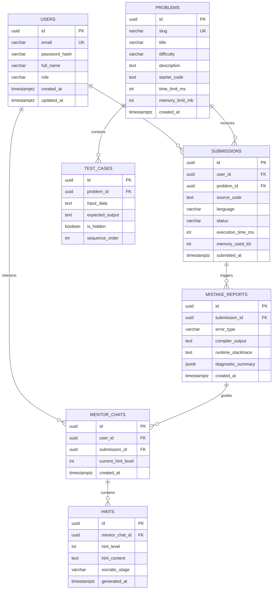

# Database Design & Migrations

## 1. Design Principles

- **RDBMS**: PostgreSQL 16+.
- **Schema Management**: Flyway database migrations under `backend/src/main/resources/db/migration/`.
- **Naming Conventions**:
  - Tables and columns: `snake_case`.
  - Primary keys: `UUID` or `BIGSERIAL` (UUID preferred for public identifiers).
  - Foreign keys: `<referenced_table_singular>_id`.
  - Timestamps: `created_at`, `updated_at` (UTC `TIMESTAMP WITH TIME ZONE`).
- **Entity Encapsulation**: Controllers and external callers never receive JPA entities directly; all external interactions use strongly-typed DTOs.

---

## 2. Entity-Relationship Model (Conceptual)



---

## 3. Detailed Schema Definitions

### 3.1 `users`
Represents registered learners and platform administrators.
```sql
CREATE TABLE users (
    id UUID PRIMARY KEY DEFAULT gen_random_uuid(),
    email VARCHAR(255) NOT NULL UNIQUE,
    password_hash VARCHAR(255) NOT NULL,
    full_name VARCHAR(150) NOT NULL,
    role VARCHAR(50) NOT NULL DEFAULT 'LEARNER',
    created_at TIMESTAMPTZ NOT NULL DEFAULT NOW(),
    updated_at TIMESTAMPTZ NOT NULL DEFAULT NOW()
);
CREATE INDEX idx_users_email ON users(email);
```

### 3.2 `problems`
Catalog of coding challenges.
```sql
CREATE TABLE problems (
    id UUID PRIMARY KEY DEFAULT gen_random_uuid(),
    slug VARCHAR(120) NOT NULL UNIQUE,
    title VARCHAR(200) NOT NULL,
    difficulty VARCHAR(20) NOT NULL, -- EASY, MEDIUM, HARD
    description TEXT NOT NULL,
    starter_code TEXT NOT NULL,
    time_limit_ms INT NOT NULL DEFAULT 2000,
    memory_limit_mb INT NOT NULL DEFAULT 256,
    is_active BOOLEAN NOT NULL DEFAULT TRUE,
    created_at TIMESTAMPTZ NOT NULL DEFAULT NOW(),
    updated_at TIMESTAMPTZ NOT NULL DEFAULT NOW()
);
CREATE INDEX idx_problems_difficulty ON problems(difficulty);
CREATE INDEX idx_problems_slug ON problems(slug);
```

### 3.3 `test_cases`
Test suites for problems, distinguishing sample/public tests from evaluation/hidden tests.
```sql
CREATE TABLE test_cases (
    id UUID PRIMARY KEY DEFAULT gen_random_uuid(),
    problem_id UUID NOT NULL REFERENCES problems(id) ON DELETE CASCADE,
    input_data TEXT NOT NULL,
    expected_output TEXT NOT NULL,
    is_hidden BOOLEAN NOT NULL DEFAULT FALSE,
    sequence_order INT NOT NULL DEFAULT 0,
    created_at TIMESTAMPTZ NOT NULL DEFAULT NOW()
);
CREATE INDEX idx_test_cases_problem_id ON test_cases(problem_id);
```

### 3.4 `submissions`
Tracks all code submissions and outcomes.
```sql
CREATE TABLE submissions (
    id UUID PRIMARY KEY DEFAULT gen_random_uuid(),
    user_id UUID NOT NULL REFERENCES users(id) ON DELETE CASCADE,
    problem_id UUID NOT NULL REFERENCES problems(id) ON DELETE CASCADE,
    source_code TEXT NOT NULL,
    language VARCHAR(30) NOT NULL DEFAULT 'JAVA',
    status VARCHAR(50) NOT NULL, -- PENDING, RUNNING, ACCEPTED, WRONG_ANSWER, COMPILE_ERROR, TIME_LIMIT_EXCEEDED, RUNTIME_ERROR
    execution_time_ms INT,
    memory_used_kb INT,
    tests_passed INT DEFAULT 0,
    total_tests INT DEFAULT 0,
    submitted_at TIMESTAMPTZ NOT NULL DEFAULT NOW()
);
CREATE INDEX idx_submissions_user_id ON submissions(user_id);
CREATE INDEX idx_submissions_problem_id ON submissions(problem_id);
CREATE INDEX idx_submissions_status ON submissions(status);
```

### 3.5 `mistake_reports`
Sanitized diagnostic analysis derived from failed submissions.
```sql
CREATE TABLE mistake_reports (
    id UUID PRIMARY KEY DEFAULT gen_random_uuid(),
    submission_id UUID NOT NULL REFERENCES submissions(id) ON DELETE CASCADE,
    error_type VARCHAR(60) NOT NULL, -- SYNTAX, RUNTIME_EXCEPTION, LOGIC_ASSERTION, TIMEOUT
    compiler_output TEXT,
    runtime_stacktrace TEXT,
    diagnostic_summary JSONB,
    created_at TIMESTAMPTZ NOT NULL DEFAULT NOW()
);
CREATE INDEX idx_mistake_reports_submission_id ON mistake_reports(submission_id);
```

### 3.6 `mentor_chats` and `hints`
Maintains conversational state and progressive hint ladder history.
```sql
CREATE TABLE mentor_chats (
    id UUID PRIMARY KEY DEFAULT gen_random_uuid(),
    user_id UUID NOT NULL REFERENCES users(id) ON DELETE CASCADE,
    submission_id UUID NOT NULL REFERENCES submissions(id) ON DELETE CASCADE,
    current_hint_level INT NOT NULL DEFAULT 1,
    created_at TIMESTAMPTZ NOT NULL DEFAULT NOW(),
    updated_at TIMESTAMPTZ NOT NULL DEFAULT NOW()
);

CREATE TABLE hints (
    id UUID PRIMARY KEY DEFAULT gen_random_uuid(),
    mentor_chat_id UUID NOT NULL REFERENCES mentor_chats(id) ON DELETE CASCADE,
    hint_level INT NOT NULL, -- 1, 2, 3, 4
    socratic_stage VARCHAR(50) NOT NULL, -- NUDGE, CONCEPTUAL, ALGORITHMIC, TARGETED_POINTER
    hint_content TEXT NOT NULL,
    structured_data JSONB,
    generated_at TIMESTAMPTZ NOT NULL DEFAULT NOW()
);
CREATE INDEX idx_hints_chat_id ON hints(mentor_chat_id);
```

---

## 4. Migration Strategy

- Migrations follow standard Flyway format: `V{VERSION}__{DESCRIPTION}.sql`.
- Migration files are immutable once applied. Changes to schema require a new forward migration script.
- Flyway automatically validates checksums upon Spring Boot startup.
